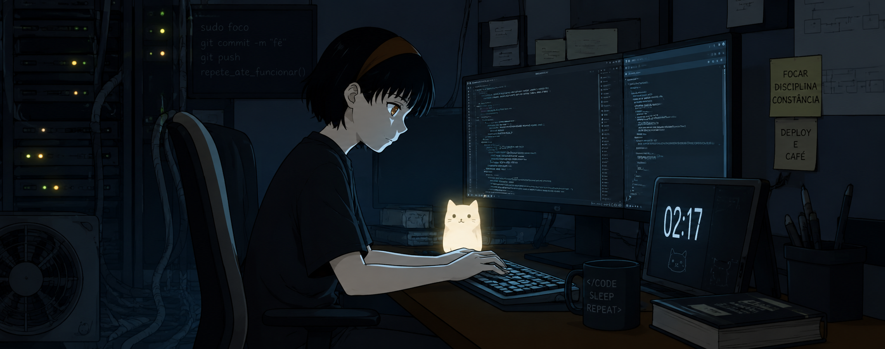

### 🖖 Saudações, eu sou Raissa Vasconcelos

### Full Stack Developer | Itajaí, Brazil

#### 📱 Contatos

  
  

#### 🖥️ Tecnologias

  

* TypeScript
* React
* Node.js
* NestJS
* MySQL
* Docker
* Git
* Atualmente estudando C# e .NET

#### 💼 Experiência

**Front-End Developer | ClickCannabis**

📅 Abril/2024 - Abril/2026 (Remoto)

* Desenvolvimento e manutenção de interfaces web utilizando React, JavaScript e TypeScript.
* Integração com APIs REST e implementação de melhorias de usabilidade e responsividade.
* Correção de bugs e apoio em ajustes de serviços backend utilizando Node.js.

#### 📚 Atualmente Estudando

  
  
  

